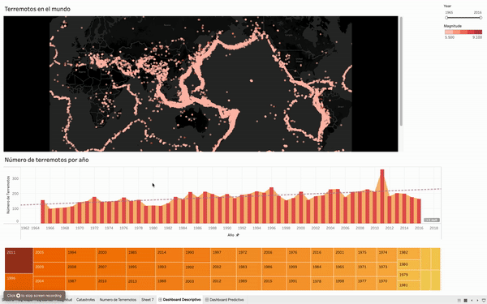

# mongo-pyspark-tableau
It is a very interesting repo where three technologies are combined for data analysis and visualization. To carry out this small project, Mongo DB is used for databases, PySpark was used to create ETLs (Extract, Transform, Loading) and Tableau for data visualization.

In this study, the behavior of natural disasters is analyzed, in order to obtain a spatial understanding of the areas with the greatest presence of events.

The data for the analysis is a compendium of the telluric phenomena produced from 1965 to 2016 and that have been documented through different sensors installed to observe the behavior and its impact.

The data set contains 23,412 records that have been taken from the National Earthquake Information Center (NEIC), which is one of the centers in charge of the study and understanding of seismic phenomena and their effects.

On this occasion, I am going to present you with a very interesting article where three technologies are combined for data analysis and visualization. To carry out this small project, Mongo DB is used for databases, PySpark was used to create ETLs (Extract, Transform, Loading), and Tableau for data visualization.

Based on the processed data we can observe an area on the globe that is known as the ring of fire, in these areas investors must consider complementary elements in terms of the supply chain, these areas tend to have higher associated prices to the assets and the insurance elements consider more severe policies to classify the risk.

By using visual elements such as charts, graphs, and maps, data visualization tools provide an accessible way to view and understand trends, outliers, and patterns in your data.
In the world of big data, data visualization tools and technologies are essential for analyzing large amounts of information and making data-driven decisions.